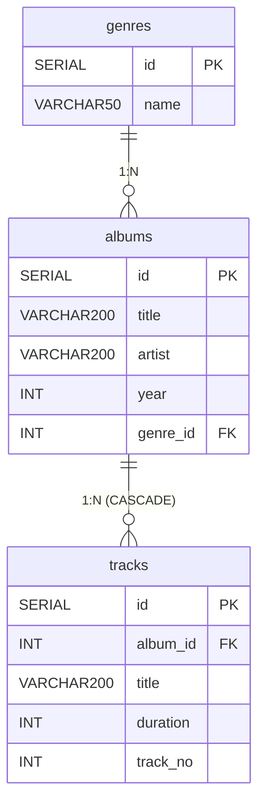

# 🎵 Hudební sbírka

Desktopová aplikace pro správu hudební sbírky. Umožňuje evidovat alba s jejich skladbami.

## Technologie

- **Avalonia UI** (MVVM) — .NET 10
- **PostgreSQL 16** v Dockeru
- **Npgsql**, **DotNetEnv**, **Microsoft.Extensions.DependencyInjection**, **CommunityToolkit.Mvvm**

## Datový model

```
genres   (id, name)
albums   (id, title, artist, year, genre_id → genres)
tracks   (id, album_id → albums, title, duration, track_no)
```

## Jak rozjet projekt

### 1. Požadavky

- [.NET 10 SDK](https://dotnet.microsoft.com/download)
- [Docker Desktop](https://www.docker.com/products/docker-desktop/)
- JetBrains Rider (nebo jiné IDE)

### 2. Klonování

```bash
git clone <url-repozitare>
cd MusicLibrary
```

### 3. Konfigurace prostředí

```bash
cp .env.example .env
```

Soubor `.env` **neupravuj** — výchozí hodnoty fungují rovnou s Docker Compose.

### 4. Spuštění databáze

```bash
docker compose up -d
```

Při prvním spuštění Docker automaticky:
- vytvoří tabulky (`schema.sql`)
- naplní číselník žánrů (`seed.sql`)

### 5. Spuštění aplikace

V Rider: otevři solution a stiskni **F5** (nebo zelený trojúhelník).

Případně z terminálu:

```bash
dotnet run
```

### 6. Zastavení databáze

```bash
docker compose down
```

Data zůstanou uložena v Docker volume — přežijí restart.

## Struktura projektu

```
MusicLibrary/
├── Models/              # Genre, Album, Track
├── Repositories/        # Interface + implementace pro každou entitu
├── ViewModels/          # AlbumListViewModel, AlbumDetailViewModel, AlbumFormViewModel
├── Views/               # Odpovídající AXAML views
├── Services.cs          # Dependency Injection — registrace všech služeb
├── App.axaml.cs         # Vstupní bod, navigace mezi views
├── docker-compose.yaml
├── schema.sql           # CREATE TABLE
├── seed.sql             # Naplnění číselníku žánrů
├── .env.example         # Šablona konfigurace
└── .gitignore
```

## Funkce

- **alba**: přidat, upravit, smazat, zobrazit seznam
- **skladby**: přidat, upravit, smazat v rámci detailu alba
- **žánr**: výběr z číselníku přes ComboBox
- validace povinných polí s chybovými hláškami
- data persistována v PostgreSQL přes Docker volume

## ER Diagram

